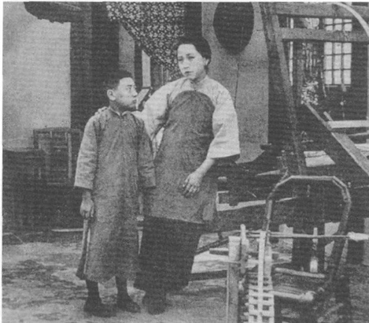

# 一个时代的偶像：娜拉

有趣的是，与充满男性启蒙者形象的历史文本不同，在文学、艺术、电影中清晰显现、不断地感动一代又一代人的，却是一个鲜明的女性形象序列。一个在现当代中国文化范畴内，众所周知的事实是，在五四新文化运动的浪潮中，构成了一代人之镜像的，是挪威剧作家易卜生(Henrik Ibsen)《玩偶之家》中的女主人公娜拉\[5][^1]一代人从娜拉那里学会了「出走」当「玩偶之家」的大门在娜拉身后砰然关闭的时候，一代置身于大时代冲击中的新青年／新女性获得了勇气和力量，挣脱封建血缘家庭的羁绊，怀着无限美好的梦想，投奔新生活。然而，早在我与孟悦共同撰写的旧作《浮出历史地表：中国现代女性文学研究》一书中，我们便曾经指出，当娜拉成为五四一代人的精神象征，两个有趣的错位，便隐含其中。其一，是无论现实主义剧作家易卜生的原作包含了多少种阐释或曰产生歧义的可能，但他所书写的确乎是一个「苏醒」了的女人反叛资产阶级婚姻、乃至道德、法律、宗教之伪善的故事，一个女人从男人所把持、置女人于玩偶地位的核心家庭中毅然出走的故事。但作为五四一代的象征，娜拉这一形象已被抽离为一个反叛的姿态和一个出走的动作——用胡适在〈易卜生主义〉一文的说法，便是「真益纯粹的为我主义」实践，而剧情中的现代核心家庭被置换为中国封建血缘家庭。于是，易卜生原作中对以婚姻、核心家庭为象征的现代资产阶级道德、法律、宗教的尖锐批判，转移为中国启蒙话语中现代资本主义文化逻辑的确认。其二，则是具体到「少年中国」之女、五四新女性，当封建父权置换了现代男权，这一姿态与动作，便由面对伪善的丈夫宣布：「首先我是一个人，跟你一样的一个人」\[6][^2]而转换为面对父亲宣称：「我是我自己的」，尔后自主婚姻选择。事实上，以胡适的《终身大事》所开启的一系列中国版的「娜拉剧」\[7][^3]正是做出了如是改写。于是，相对于女性，这一反叛、出走的历史时刻，蜕变成由父亲之家进入丈夫之家的「序曲」，所不同的，只是这夫家由「女儿」自主选择（「孩儿的终身大事，孩儿该自己决断」，「我是我自己的，他们谁也没有干涉我的权利！」）\[8][^4]，而且由封建血缘家庭演化为现代核心家庭。在父权之家与夫权之家中间，留下的只是一道罅隙，一个难于延展的瞬间，一座令一代五四之女辗转反侧、无尽徘徊的悬浮历史的舞台。

如果说，易卜生和他的娜拉在五四时代，不仅是在文学或文化的历史上，留下了一个决绝的动作，一份不无悲壮的自我想象；那么在这一时代的文化实践中，这一出走的行为，却远为繁复、犹疑。因为前现代中国的血缘家庭，尽管在新文学的书写中，成了「狭的笼」、乃至「吃人筵席」中一景，其中的「旧」女性被书写为一个「死女人」；但就继续在五四所造成的历史断裂处的绵延的社会现实生存而言，家族／血缘家庭不仅继续充当着中国社会政治生活的结构性基础之一，而且，它原本便不是或不仅是权力的威压，而更多地实践为亲情的牵系和索取。鲁迅所谓「我有一个母亲，还有些爱我，愿我平安，我为了感激他的爱，只能不照自己所愿意做的做……」\[9][^5]，婚姻「是母亲给我一件礼物，我只能好好地供养他，爱情是我所不知道的」。\[10][^6]于是，不仅鲁迅，或撰写《终身大事》的胡适，众多五四新文化运动的主将，妇女解放的主要倡导者，自己都无法或无力在自主婚姻这一极其「个人」的问题上，迈出「娜拉的一步」。在这个意义上，作为对「娜拉走后怎样」的答案之一，〈伤逝〉里最终「回来」的子君，未始不是五四一代男性文人自况的假面。他们不断地告别，又不断地「回来」；他们始终不能「出走」，而只是不断地离去或「回来」，以致辗转终身。

当出走的娜拉成为五四主舞台上一个光彩夺目的形象，在国片银幕上轰动之作却是《孤儿救祖记》\[11][^7]。影片充溢着十足的前现代、老中国的气息。女主人公余蔚如历经劫难，却深明大义，忍辱负重地教子成人，终于苦尽甘来。饰演余蔚如的女演员王汉伦一举登临明星宝座，被称为「中国第一悲旦」。

《孤儿救祖记》由此开创中国电影的一个准类型：以女性为第一主角的「苦情戏」。早期中国影人程步高对这一准类型的定义是：「除劝人为善及情味浓厚外，主要放在戏剧性和情节性上，不是轻描淡写，而是加强，特别加强。特别在悲剧部分，在观众最同情的好人身上，尤其在无依无靠饱尝痛苦的女主角身上，情节性加浓，戏剧性加强。把人世间一切惨痛事，只要是可能的，不是一件，是一连串，都压在叫天不应，呼地不灵，孤立无援，悲惨万分的女主角身上，给压得喘不过气，抬不起头，翻不了身，好像待罪羔羊，任人宰割，吃尽人间苦楚。

<figure><figcaption>
《孤儿救祖记》
</figcaption></figure>

这位悲剧的女主角，观众同情于前，当然起共鸣于后。剧中人痛苦，观众亦痛苦，剧中人流泪，观众亦流泪\[12][^8]。无需细查，已然可以发现这一「苦情戏」电影有着传统中国戏曲：秦香莲、〈琵琶计〉之赵五娘的脉络。但略加细查，无疑可以发现，这老中国的苦情故事已经转移了「演出」空间。其中祖孙重聚、沉冤得雪的空间，变成了现代平民学校；而女主角获得正名后的善举则是捐资助学；换言之，一个情节剧的救赎空间，同时叠加着现代教育之于社会的救赎意义。更为有趣的是，彼时由影片所引发的社会议题，竟是现代法律：关于遗产与继承权的讨论。

<figure><figcaption>
第一「悲旦」王汉伦
</figcaption></figure>

这无疑显现了滞后于五四新文化运动的中国电影在不期然间所扮演的社会角色：在日常生活与大众文化的层面上，以老中国的故事和表象履行文化现代化的社会功能，同时将某种前现代中国社会生存的经验及其表达整合、组织到现代生活之中。但实践这一功能的途径，却是通过将女主角放置到欲望观看视野与「一连串」的灾难沐浴之中来完成；用精神分析或劳拉·穆尔维式的表述，便是女主角成为男性观看主体窥视与施虐心理投射的双重客体。

更为有趣的是，因饰演余蔚如而一举成为上海滩超级明星的王汉伦正是一个名符其实的「新女性」，她不仅曾在教会学校中接受中学教育，而且正是为了从丈夫之家毅然出走而与夫家、母家彻底决裂、且并未「堕落」或「回来」而独立生存、获得了社会性成功的「娜拉」王汉伦的双重故事：作为社会中成功的「新女性」和作为银幕上的现代版「秦香莲」，一如五四新文学的重要代表人物女作家庐隐起伏跌宕的个人生活与她「十年停滞」的文学书写之间的巨大裂隙，暗示着现代中国文化如何在这千年未有之大变局中辗转，暗示着远比此间关于女性的书写和女性书写更为大胆果决的新女性的社会实践与生存，如何在「无先例可循」的文化空白与形成中的新主流文化的规范间挣扎的现实。「新女性」的文化浮现，要迟至十余年之后，但彼时中国社会的格局已再度经历剧变。

[^1]: 自1907年起鲁迅连续撰文介绍易卜生·1914年戏剧家陆镜若在《佛优志》创刊号上发表《伊蒲生之剧》，介绍了包括《人形之家》在内的若干剧本。1918年6月15日《新青年》杂志出版了《易卜生专号》。发表了胡适的《易卜生主义》，袁振英的《易卜生传》，胡适与罗家偷合译的剧本《娜拉》。其后《新潮》、《戏剧》·《小说月报》和现代、春潮等书局陆续刊载、出版易卜生的作。

[^2]: 《玩偶之家》。

[^3]: 以胡滴在易卜生和《玩偶之家》的直接影响下创作的《终身大事》为始作俑者，其后出现的歌阳予倩的《激妇》，熊佛西的《新人的生活》、白薇的《打出幽灵塔》等，在现代中国文学史、话剧史上，被称为「娜拉剧」。

[^4]: 分别引自胡适的《终身大事》和鲁迅的《伤逝》。

[^5]: 鲁迅，《鲁迅书信集》(北京:人民文学，1976)，250411，致赵其文。10许寿裳，《亡友鲁迅印象记》(北京:人民文学，1977)。

[^6]: 许寿裳，《亡友鲁迅印象记》（北京：人民文学，1977)。

[^7]: 《孤儿救租记》，导演:张石川，编剧:郑正秋，摄影:张伟涛，主演:王汉伦、郑小秋、郑鹧鸪，黑白，无声，明星电影股份有限公司，1923年。这是中国电影史上第一部获得票房奇的国产影片，并由此引发了第一次国产影片制作热潮。影片讲述大家少奶奶余蔚如有身孕遭遇丧夫修变，又遭恶戚调戏，后者被坚拒后诬陷蔚如不真，致使她为夫家所逐。蔚如产子余璞，含辛茹苦抚养儿子。余璞长大，进入一所平民学校就读，与兴建义学的富翁结识，不知其正是租父。后余璞救了祖父，且恶人临终忏悔，蔚如沉冤得雪，回归夫家，并将所继承的遗产半数捐资助学。

[^8]: 程步高，《影坛忆旧》(北京:中国电影，1983)。
